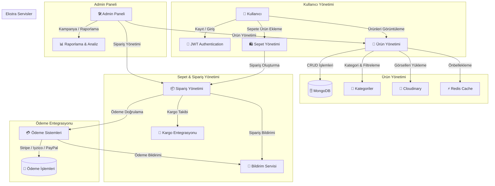

### **📌 E-Ticaret Backend Diyagramı (Mermaid Formatı)**

---

### **💡 Açıklamalar**
- **Kullanıcılar** → Ürünleri görebilir, sepete ekleyebilir, sipariş oluşturabilir.
- **Ürün Yönetimi** → Ürünler eklenir/güncellenir, kategorilere ayrılır, önbellekleme kullanılır.
- **Sepet & Sipariş Yönetimi** → Kullanıcılar sipariş oluşturur, sipariş kargo süreci takip edilir.
- **Ödeme Entegrasyonu** → Stripe, Iyzico veya PayPal üzerinden ödeme alınır.
- **Admin Paneli** → Siparişleri ve ürünleri yönetir, kampanyalar düzenler, raporlar oluşturur.
- **Ekstra Servisler** → Redis önbellekleme, Cloudinary/AWS S3 dosya yükleme, bildirim sistemi.

---

Bu diyagramı **Mermaid destekleyen bir Markdown editöründe** (GitHub, Obsidian, Typora, VS Code Mermaid Plugin) doğrudan çalıştırabilirsiniz. 🚀